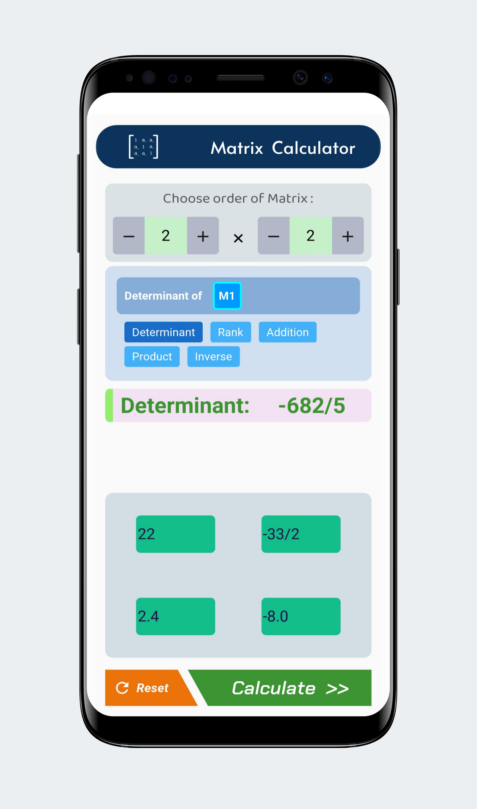
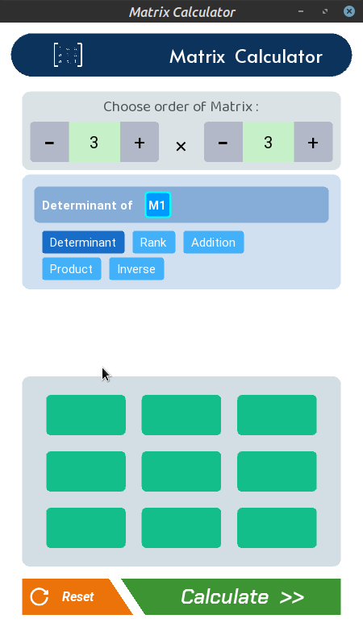

## Introduction
Matrices look beautiful as well as are highly useful for both Data Manipulation & Getting marks in exams.
But performing those calculations can drill deep into your mind and are prone to silly mistakes.  
To make such work easier, this project exists. :wink:

## Features

- Currently Determinant, Addition, Product, Inverse and Rank of matrix are implemented
- Supports matrix order upto 4
- Accepts input as integers, decimals or even from fractions
- Proper Error Handling
- Sleek & Minimalist design

[**:star: See all Releases \| Source Codes \| Executables \:star:**](https://github.com/dcindia/matrix-calculator/releases)  

| Android | Linux | Windows |
| ------- | ----- | ------- |
|  |  |  |
|  |

## Roadmap
+ Support mathematical functions like sqrt(), sin(), cos() etc.
+ Add more single value functions such as Minors, Co-factors, Adjoint etc.  
+ Show Human-Friendly steps followed to reach respective result
+ **_Any Improvements or Added Features are heartly welcomed._**

**If you encounter any issues, please report in [**Issues**](https://github.com/dcindia/matrix-calculator/issues) Section.**

<table>
  <tr>
  <td>
    <td> </td>
 </tr>
<tr>
<td> </td>
  <td> </td>
  </tr>
  </table>

