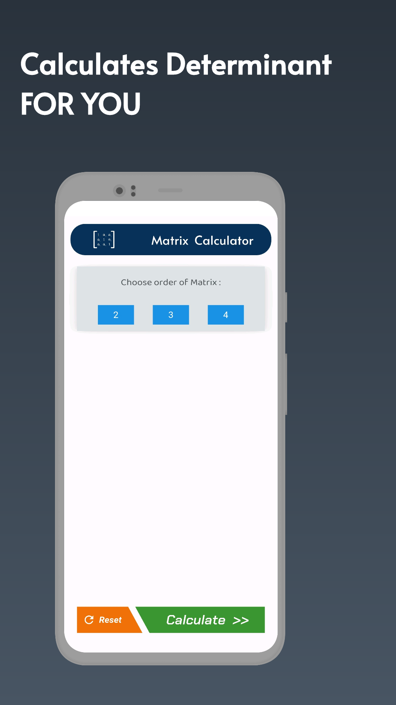
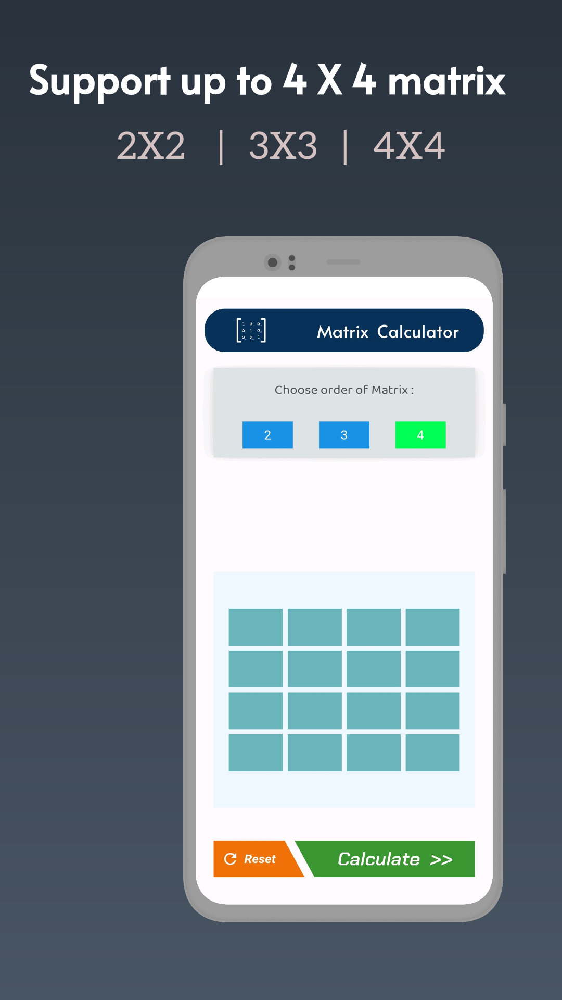
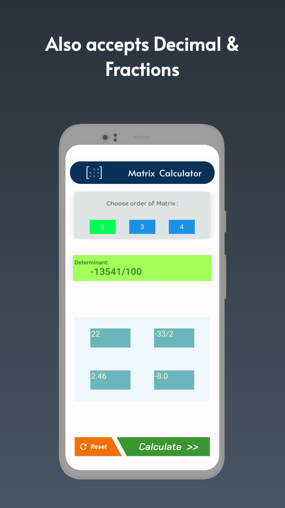
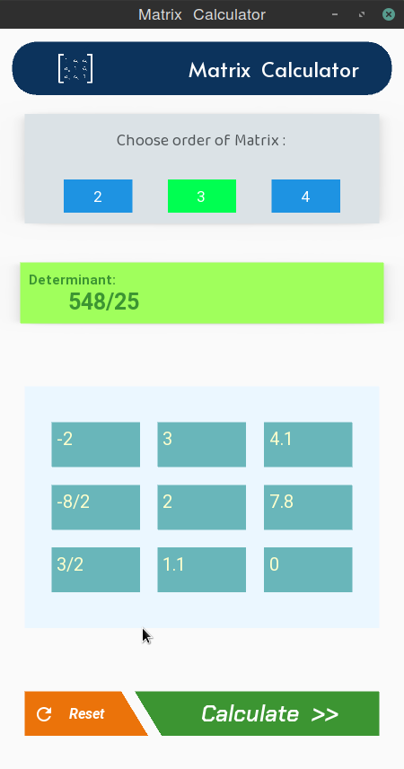

## Introduction
Matrices look beautiful as well as are highly useful for both Data Manipulation & Getting marks in exams.
But performing those calculations can drill deep into your mind and are prone to silly mistakes.  
To make such work easier, this project exists. :wink:

## Features

- Supports 2x2, 3x3 and 4x4 matrices
- Accepts input as integers, decimals or even from fractions
- Proper Error Handling
- Sleek & Minimalist design

[**:star: See all Releases \| Source Codes \| Executables \:star:**](https://github.com/dcindia/matrix-calculator/releases)  

| Android | Linux | Windows |
| ------- | ----- | ------- |
|  |  |  |

## Roadmap
+ Currently, only calculation of *Determinant* has been implemeted. There is a need to insert more functions like following:
+ Add more single value functions such as Rank of Matrix, Minors, Co-factors, Adjoint etc.  
+ Add Multiple matrix functions like Addition, Subtraction, Inverse of matrix, Multiplication etc.
+ Add Matrix Transformation functions like Inverse of Matrix, Elementary Operations etc.
+ Show Human-Friendly steps followed to reach respective result
+ **_Any Improvements or Added Features are heartly welcomed._**

**If you encounter any issues, please report in [**Issues**](https://github.com/dcindia/matrix-calculator/issues) Section.**

<table>
  <tr>
  <td>
    <td> </td>
 </tr>
<tr>
<td> </td>
  <td> </td>
  </tr>
  </table>

